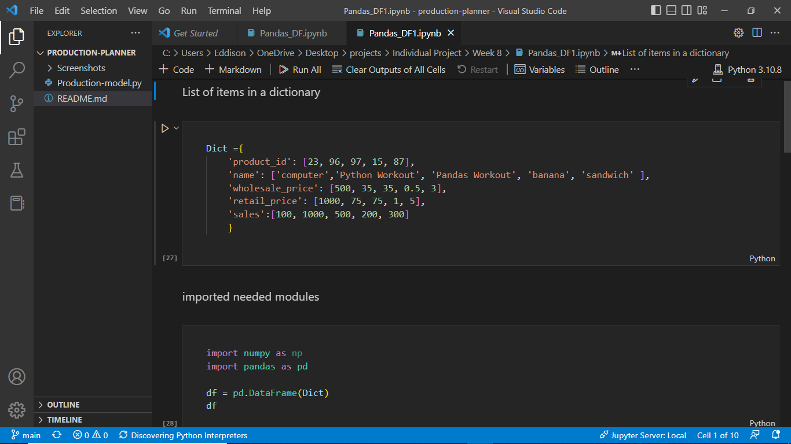
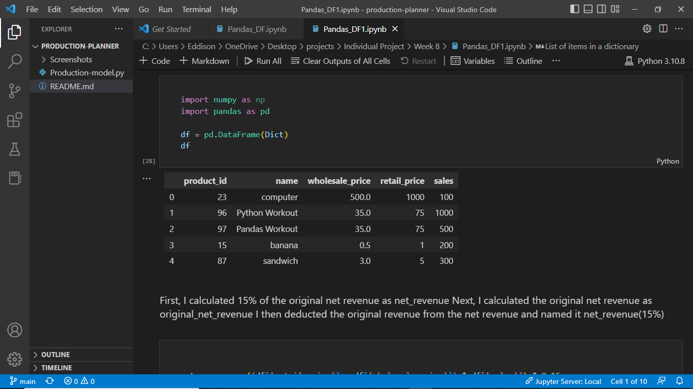
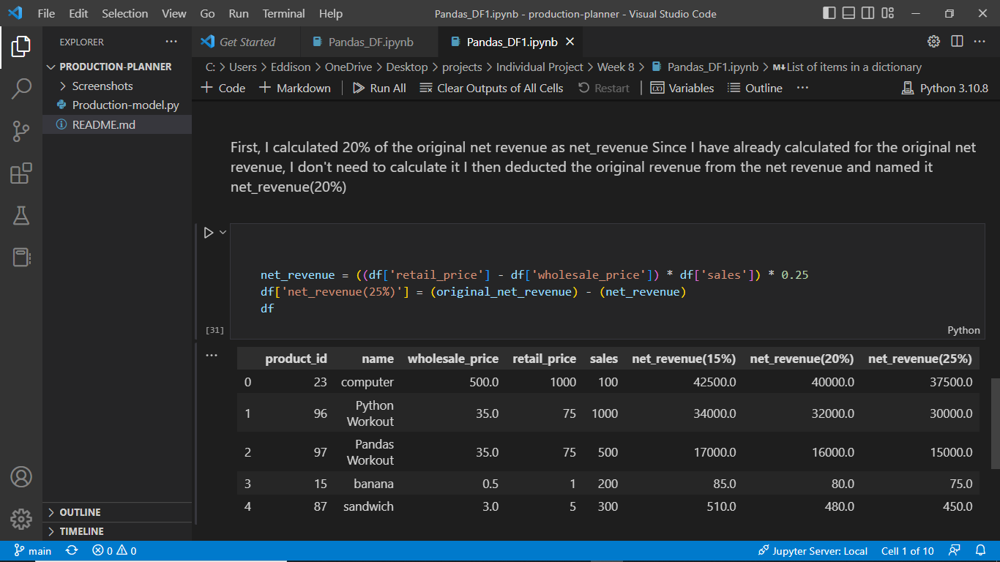

# pandas-sales

## Description
This project is aimed at using pandas :panda_face: to calculate revenues and discount on sales.

:bulb:
##Screenshots :camear: of some of the codes and their output:

&nbsp;

&nbsp;

